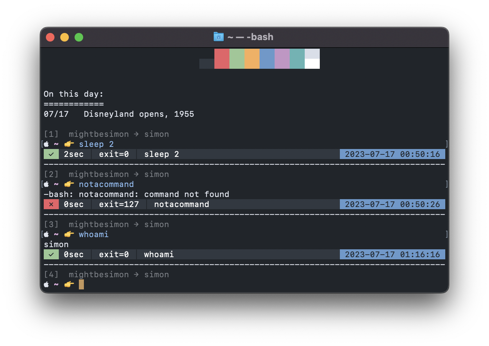

<table>
	<tr>
		<td colspan="4">
			<pre>
🇳🇿 Kia ora,
🇩🇪 Hallo, ich heiße Simon 😎
🇫🇷 Salut, moi c'est Simon 😏
🇮🇪 Dia duit, is mise Simon 😙
🇨🇳 嗨, 我叫单泉</pre>
		</td>
		<td rowspan="5">
			
		</td>
	</tr>
	<tr>
		<td colspan="4">
			<pre><h1>Hi, I'm Simon 👋</h1></pre>
		</td>
	</tr>
	<tr>
		<td colspan="3">
			<a href="https://mightbesimon.com">mightbesimon.com</a>
		</td>
		<td>
			Auckland, NZ
		</td>
	</tr>
	<tr>
		<td>
			
		</td>
		<td>
			
		</td>
		<td>
			
		</td>
		<td>
			
		</td>
	</tr>
	<tr>
		<td colspan="4">
			<pre>
💻╌╌╌╌╌ os : macOS
🐚╌╌ shell : /bin/bash
🧑‍💻╌ editor : [ vscode, sublime ]
🎨╌╌ theme : mariana</pre>
		</td>
	</tr>
</table>

## My VS Marketplace Publisher Profile

> https://marketplace.visualstudio.com/publishers/mightbesimon

vscode extension | version | installs | marketplace id
---------------- | ------- | -------- | --------------
Emoji File Icons |  |  | [mightbesimon.emoji-icons](https://marketplace.visualstudio.com/items?itemName=mightbesimon.emoji-icons)
Mariana |  |  | [mightbesimon.mariana-sublime](https://marketplace.visualstudio.com/items?itemName=mightbesimon.mariana-sublime)

## My pypi.org Publisher Profile

> https://pypi.org/user/mightbesimon/

python package | version | link
-------------- | ------- | ----
lifehacks.metaclasses |  | https://pypi.org/project/lifehacks.metaclasses/
lifehacks.colour |  | https://pypi.org/project/lifehacks.colour/
lifehacks |  | https://pypi.org/project/lifehacks/
