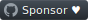

### Hi, I'm Simon 👋

<table>
	<tr>
		<td>
<pre>🇳🇿 Kia ora,
🇩🇪 Hallo, ich heiße Simon 😎
🇫🇷 Salut, moi c'est Simon 😏
🇮🇪 Dia duit, is mise Simon 😙
🇨🇳 嗨, 我叫单泉</pre>
			<p>
				<a href="mightbesimon.com">
					mightbesimon.com
				</a>&nbsp;&nbsp;|&nbsp;&nbsp;Auckland, NZ
			</p>
			<a href="https://www.instagram.com/definitely.not_simon">
				
			</a>
			&nbsp;
			<a href="https://github.com/mightbesimon">
				
			</a>
			&nbsp;
			<a href="https://www.linkedin.com/in/mightbesimon">
				
			</a>
			&nbsp;
			<a href="https://mightbesimon.com">
				
			</a>
			&nbsp;&nbsp;
			<a href="https://github.com/sponsors/mightbesimon">
				
			</a>
		</td>
		<td>
			<a href="https://mightbesimon.com">
				
			</a>
		</td>
	</tr>
</table>

```
💻 os:     MacOS
🧑‍💻 editor: vscode | sublime
🎨 theme:  mariana
```

```
📦 vscode extensions:
	mightbesimon.emoji-icons
	mightbesimon.mariana-sublime
```

add this to `.bash_profile`, thank me later

```bash
alias firealarm=$'git checkout main && git commit -a -m \'[draft] fire alarm\' && git push --force --set-upstream origin main'
```
